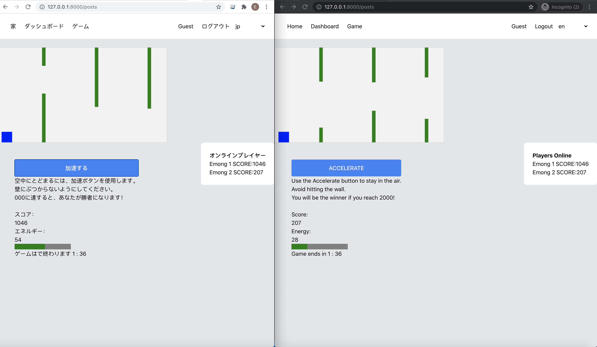
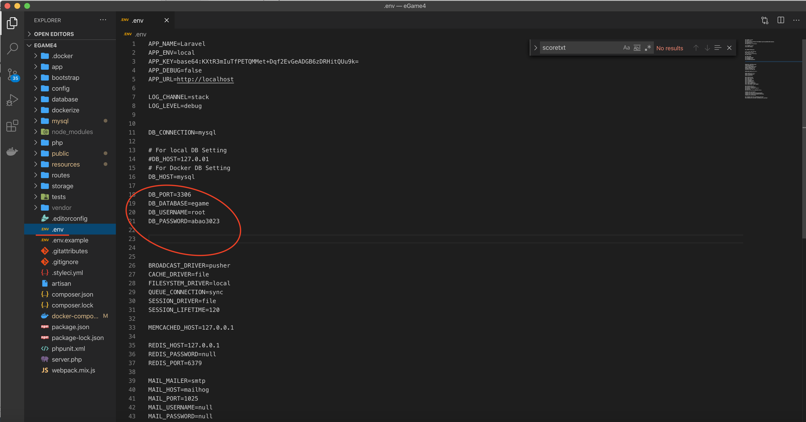
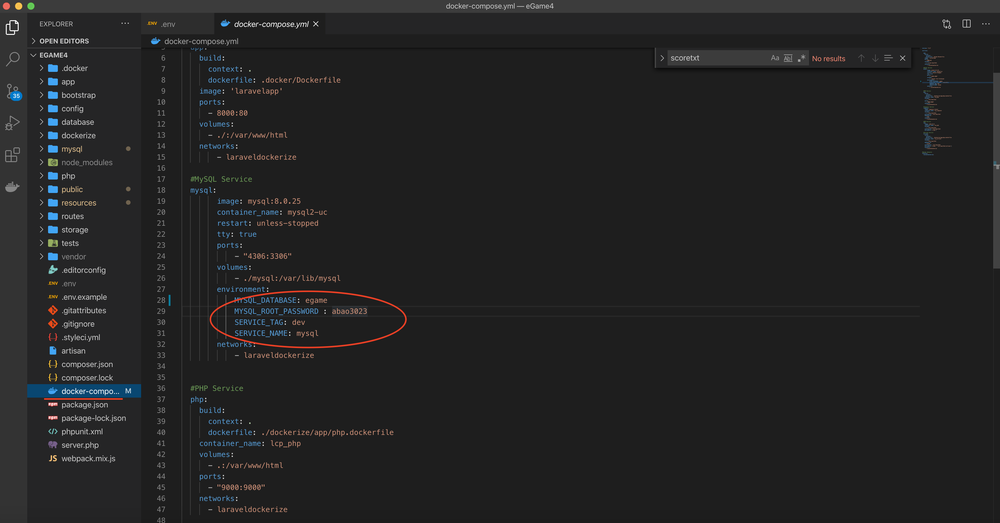
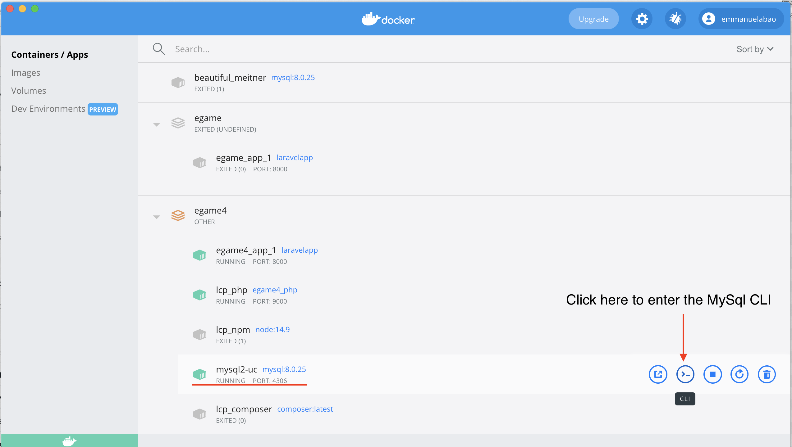
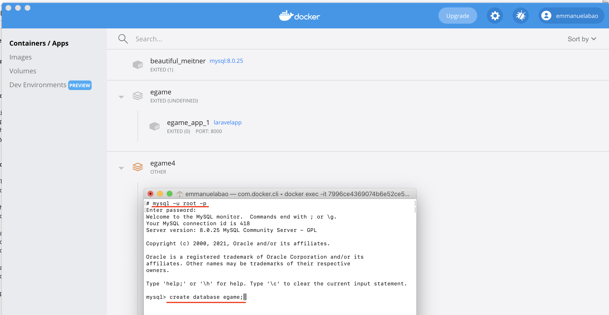
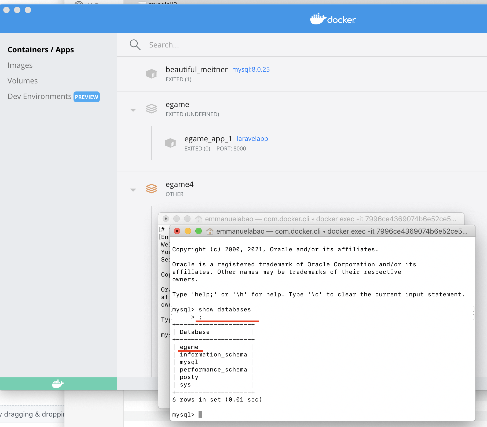
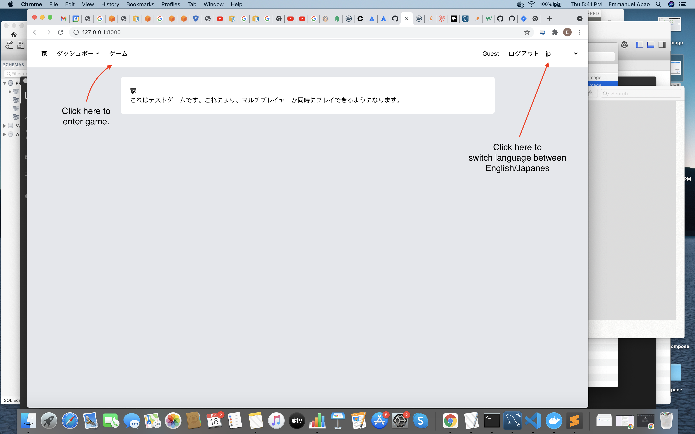
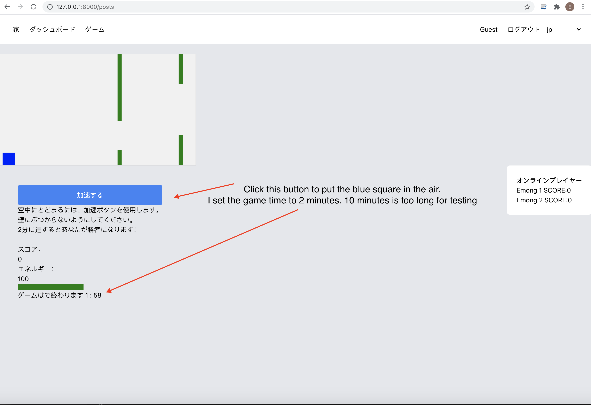

## Game Test

## YouTube Tutorial
https://www.youtube.com/watch?v=FPVnFZPErN4

## Docker Environment
 
 - Linux/Ubuntu
 - Apache
 - Php 7.4
 - Mysql 8

## How to setup the game

1. Create a folder on your Desktop and clone this repository to the folder. 
   command: git clone https://github.com/abaoel/eGame.git

2. Change directory to the egame directory 
   command: cd egame

   Copy the file .env.example to .env 
   command: cp .env.example .env

   Edit the following in the .env to your own credentials.  
   DB_DATABASE=egame 
   DB_USERNAME=root 
   DB_PASSWORD=******* 
   
   Edit the database credentials to your own credentials in the .env and docker-compose.yml file.
   
   
   
3. Make sure you have Composer and NPM. Run Composer Install and NPM Install 
   command: composer install 
   command: NPM install
   
4. Make sure your Docker software is running and run the command below. 
   command: docker-compose up -d

5. Open Docker for Mac or PC, then loging to the docker mysql container (see image below)

6. Create the database egame.

 
Exit from MySql container and go back to the main terminal/command in the egame folder.
 

7. Run the command: docker-compose exec php php /var/www/html/artisan migrate
8. Run the command: docker-compose exec php php /var/www/html/artisan db:seed --class=UserSeeder

Navigate to http://127.0.0.1:8000/

see images below for instructions on how to play the game.

