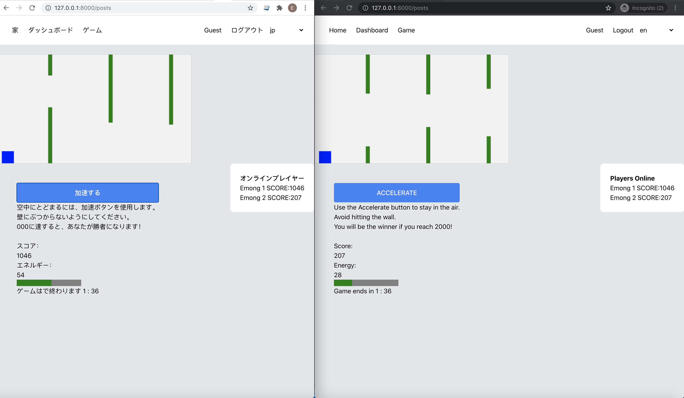
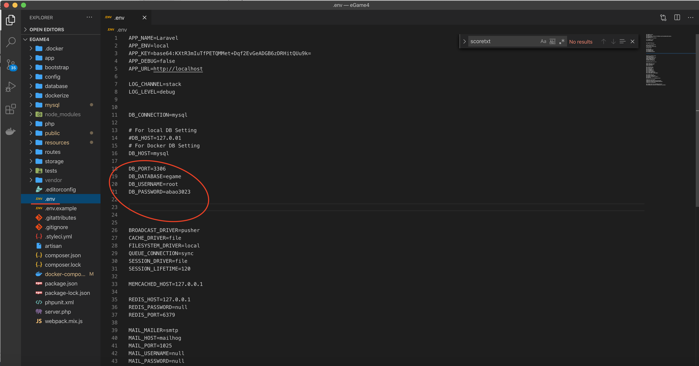
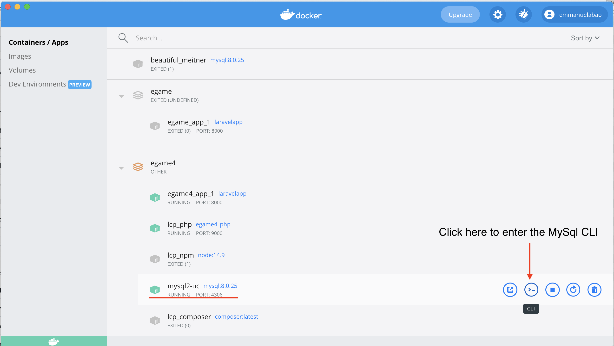
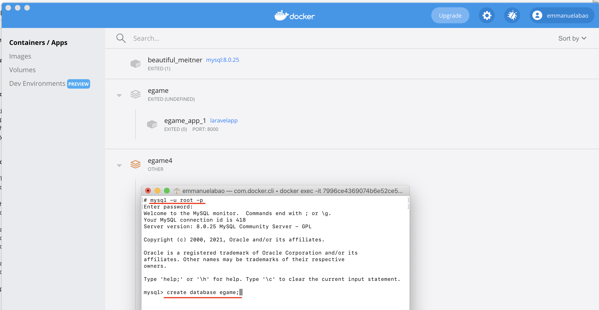
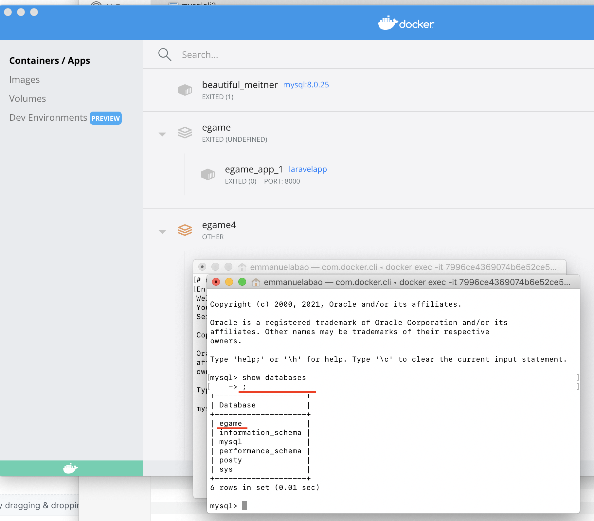
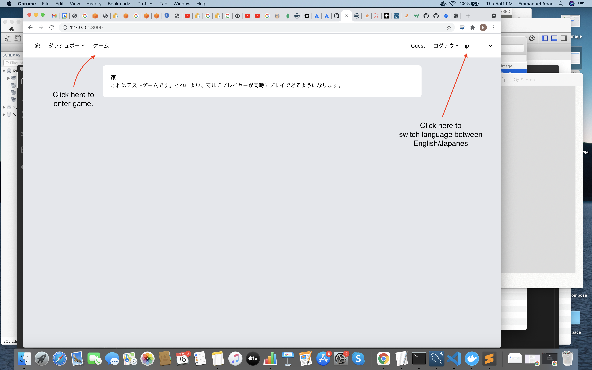
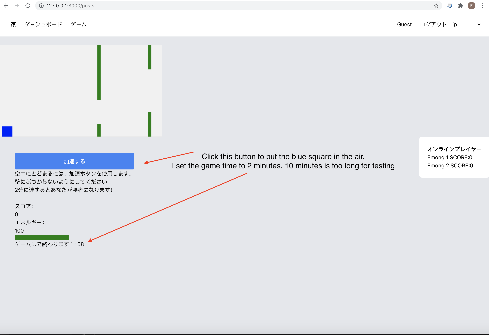

## Game Test

## Docker Environment
 
 - Linux/Ubuntu
 - Apache
 - Php 7.4
 - Mysql 8

## How to setup the game

1. Clone this repository to your local computer.
   command: git clone https://github.com/abaoel/eGame.git

2. Change directory to the egame directory
   command: cd egame
   
   Edit the database credentials to your own credentials in the .env and docker-compose.yml file.
   
   
   
3. Make sure you have Composer and NPM. Run Composer Install and NPM Install
   command: composer install
   command: NPM install
   
4. Make sure your Docker software is running and run the command below.
   command: docker-compose up -d

5. Open Docker for Mac or PC, then loging to the docker mysql container (see image below)

6. Create the database egame.

7. Run the command: docker-compose exec php php /var/www/html/artisan migrate
8. Run the command: docker-compose exec php php /var/www/html/artisan db:seed --class=UserSeeder

Navigate to http://127.0.0.1:8000/

see images below for instructions on how to play the game.

Note: Due to development time constraints, quality of graphics, UI, and UX are not that good.
